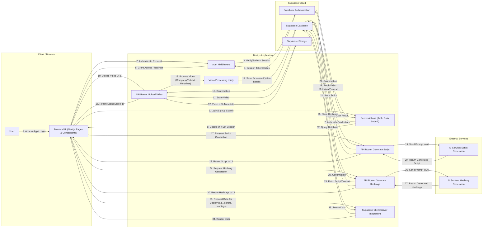

# System Architecture

```mermaid
graph LR
    subgraph "Client / Browser"
        USR["User"]
        FE_UI["Frontend UI (Next.js Pages & Components)"]
    end

    subgraph "Next.js Application"
        AUTH_MW["Auth Middleware"]
        SERVER_ACTIONS["Server Actions (Auth, Data Submit)"]
        API_UPLOAD["API Route: Upload Video"]
        API_SCRIPT["API Route: Generate Script"]
        API_HASHTAGS["API Route: Generate Hashtags"]
        SB_CLIENT_SERVER_UTILS["Supabase Client/Server Integrations"]
        VIDEO_PROC_UTIL["Video Processing Utility"]
    end

    subgraph "Supabase Cloud"
        SB_AUTH["Supabase Authentication"]
        SB_DB["Supabase Database"]
        SB_STORAGE["Supabase Storage"]
    end

    subgraph "External Services"
        AI_SCRIPT_GEN["AI Service: Script Generation"]
        AI_HASHTAG_GEN["AI Service: Hashtag Generation"]
    end

    %% Flow 1: User Interaction & Authentication
    USR -- "1. Access App / Login" --> FE_UI
    FE_UI -- "2. Authenticate Request" --> AUTH_MW
    AUTH_MW -- "3. Verify/Refresh Session" --> SB_AUTH
    SB_AUTH -- "4. Session Token/Status" --> AUTH_MW
    AUTH_MW -- "5. Grant Access / Redirect" --> FE_UI

    FE_UI -- "6. Login/Signup Submit" --> SERVER_ACTIONS
    SERVER_ACTIONS -- "7. Auth with Credentials" --> SB_AUTH
    SB_AUTH -- "8. Return Auth Result" --> SERVER_ACTIONS
    SERVER_ACTIONS -- "9. Update UI / Set Session" --> FE_UI

    %% Flow 2: Video Upload & Processing
    FE_UI -- "10. Upload Video URL" --> API_UPLOAD
    API_UPLOAD -- "11. Store Video" --> SB_STORAGE
    SB_STORAGE -- "12. Video URL/Metadata" --> API_UPLOAD
    API_UPLOAD -- "13. Process Video (Compress/Extract Metadata)" --> VIDEO_PROC_UTIL
    VIDEO_PROC_UTIL -- "14. Save Processed Video Details" --> SB_DB
    SB_DB -- "15. Confirmation" --> API_UPLOAD
    API_UPLOAD -- "16. Return Status/Video ID" --> FE_UI

    %% Flow 3: Script Generation
    FE_UI -- "17. Request Script Generation" --> API_SCRIPT
    API_SCRIPT -- "18. Fetch Video Metadata/Context" --> SB_DB
    API_SCRIPT -- "19. Send Prompt to AI" --> AI_SCRIPT_GEN
    AI_SCRIPT_GEN -- "20. Return Generated Script" --> API_SCRIPT
    API_SCRIPT -- "21. Store Script" --> SB_DB
    SB_DB -- "22. Confirmation" --> API_SCRIPT
    API_SCRIPT -- "23. Return Script to UI" --> FE_UI

    %% Flow 4: Hashtag Generation
    FE_UI -- "24. Request Hashtag Generation" --> API_HASHTAGS
    API_HASHTAGS -- "25. Fetch Script/Context" --> SB_DB
    API_HASHTAGS -- "26. Send Prompt to AI" --> AI_HASHTAG_GEN
    AI_HASHTAG_GEN -- "27. Return Generated Hashtags" --> API_HASHTAGS
    API_HASHTAGS -- "28. Store Hashtags" --> SB_DB
    SB_DB -- "29. Confirmation" --> API_HASHTAGS
    API_HASHTAGS -- "30. Return Hashtags to UI" --> FE_UI

    %% Flow 5: Data Retrieval & Display
    FE_UI -- "31. Request Data for Display (e.g., scripts, hashtags)" --> SB_CLIENT_SERVER_UTILS
    SB_CLIENT_SERVER_UTILS -- "32. Query Database" --> SB_DB
    SB_DB -- "33. Return Data" --> SB_CLIENT_SERVER_UTILS
    SB_CLIENT_SERVER_UTILS -- "34. Render Data" --> FE_UI
```

*Last updated automatically by Gemini.*